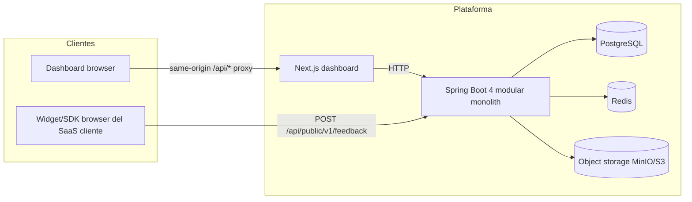

# ARCHITECTURE — Feedback Platform

Arquitectura definitiva del sistema. Las decisiones con alternativas están en `DECISIONS.md`; el *qué/cuándo* está en `PLAN.md`.

---

## 1. Vista general

**Modular monolith**: un único despliegue backend (Spring Boot 4) organizado por dominios, un dashboard (Next.js), PostgreSQL como fuente de verdad, Redis para preocupaciones efímeras y object storage para binarios.



## 2. Componentes

### 2.1 Frontend — `frontend/` (Next.js)

Dashboard de administración. **Sin lógica de negocio**: autorización, validación de dominio y reglas viven en el backend.

- App Router, React Server Components por defecto; Client Components solo donde hay interactividad.
- Tailwind CSS + componentes propios en `components/ui` (primitivos de design system).
- **Proxy same-origin**: `next.config.ts` reescribe `/api/backend/*` → `http://localhost:8080/api/*`. Las cookies de sesión son first-party: **sin CORS** para el dashboard y `SameSite=Lax` efectivo.
- Tipos TypeScript **generados desde el OpenAPI del backend** (`openapi-typescript`) en `src/types/api.d.ts` — fuente única de verdad, sin modelos duplicados a mano.
- Estado: datos de servidor vía fetch en RSC + invalidación (`router.refresh()` / revalidate); estado cliente mínimo y local; filtros del inbox en **URL search params** (compartibles, back-button friendly).
- Validación de formularios con zod (UX); la validación autoritativa es la del backend.

Estructura objetivo:

```
frontend/
├── AGENTS.md
├── next.config.ts
├── package.json
└── src/
    ├── middleware.ts              # redirect a /login si no hay sesión
    ├── app/
    │   ├── (auth)/login|register/
    │   ├── (app)/[orgSlug]/
    │   │   ├── page.tsx           # redirect al proyecto por defecto
    │   │   ├── [projectSlug]/inbox|issues|settings/
    │   │   ├── [projectSlug]/feedback/[feedbackId]/
    │   │   └── members/ · settings/
    │   └── layout.tsx
    ├── components/ui/             # Button, Input, Select, Badge, Modal, Table…
    ├── features/
    │   ├── auth/ · organizations/ · projects/
    │   ├── feedback/ · issues/ · comments/ · members/
    │   └── <feature>/{ components/, hooks/, api.ts, schemas.ts }
    ├── lib/api/client.ts          # fetch tipado, errores ProblemDetails
    └── types/api.d.ts             # generado (no editar a mano)
```

### 2.2 Backend — `backend/` (Spring Boot 4, Java 21)

Modular monolith organizado **por dominios**, no por capas técnicas globales.

```
com.feedbackplatform
├── FeedbackPlatformApplication.java
│
├── auth/                  # register/login/refresh/logout, password hashing, tokens
│   ├── AuthController.java
│   ├── AuthService.java            # application
│   ├── RefreshTokenService.java
│   ├── domain/ (RefreshToken)
│   ├── repository/
│   └── dto/
│
├── organization/          # Organization, OrganizationMember, Invitation, roles
├── project/               # Project, publicKey, allowedOrigins, environments
├── feedback/              # Feedback, FeedbackEvent, Tag, FeedbackTag, inbox queries, FTS
├── issue/                 # Issue, link/unlink feedback, ciclo de vida
├── comment/               # Comment (feedback XOR issue)
├── attachment/            # Attachment metadata + orquestación con FileStorageService
├── ingestion/             # API pública: rate limiting, publicKey resolution, anti-abuso
├── audit/                 # AuditLog; escucha eventos de dominio de otros módulos
│
└── shared/
    ├── config/            # SecurityConfig, WebConfig, RedisConfig, OpenApiConfig, JacksonConfig
    ├── error/             # GlobalExceptionHandler (ProblemDetails), ApiException, ErrorCodes
    ├── security/          # JwtService, AuthenticationFilter, CurrentUser, IpHasher
    ├── persistence/       # convenciones JPA, AuditMetadata listener (@CreatedDate…)
    ├── storage/           # FileStorageService, S3FileStorageService, LocalFileStorageService
    ├── web/               # pagination (cursor), sorting, RequestIdFilter
    └── util/
```

#### Reglas de dependencia entre módulos

1. Las capas dentro de un módulo: `controller → application(service) → repository`. Los controllers **no** contienen lógica ni hablan con repositories.
2. Un módulo solo puede depender de **servicios de aplicación públicos** de otro módulo (nunca de sus repositories ni entidades internas). Ej.: `ingestion` usa `ProjectService.resolveByPublicKey(...)`; `issue` usa `FeedbackService` para vincular.
3. Comunicación débilmente acoplada para efectos laterales: eventos de Spring (`FeedbackStatusChanged`, `IssueCreated`, …) que consume `audit` (y futuros `notification`/`integration`). Sin event bus externo.
4. `shared/` no depende de ningún módulo de dominio.
5. Pragmatismo: si una "capa" no aporta (p. ej. un CRUD trivial), se permite `controller → service` fino sin DTOs ceremoniosos duplicados, pero los DTOs de API nunca son las entidades JPA.

### 2.3 PostgreSQL

Fuente de verdad. Convenciones y modelo completo en `DATA_MODEL.md`. Migraciones con **Flyway** (ADR-007). JSONB solo para payloads flexibles (ADR-008). FTS con `tsvector` para la búsqueda del inbox.

### 2.4 Redis

Preocupaciones efímeras únicamente (ADR-004). Diseño de claves:

| Clave | Contenido | TTL | Uso |
|---|---|---|---|
| `project:pk:{publicKey}` | JSON `{id, organizationId, allowedOrigins, status}` | 5 min (invalidada al editar proyecto) | Resolver publicKey sin golpear PG en cada ingesta |
| `rl:ingest:{publicKey}:{ipHash}` | contador ventana deslizante (ZSET) | 1 h | 20/min y 100/h por proyecto+IP |
| `rl:auth:{ip}` / `rl:auth:{ip}:{email}` | contador | 15 min | 5 intentos/min login |
| `fp:{projectId}:{fingerprint}` | `issueId` reciente | 24 h | Sugerencia de duplicados (Phase 9) |
| `lock:{name}` | token + expiry | segundos | Locks distribuidos si hicieran falta |

Todos los accesos detrás de interfaces (`RateLimiter`, `ProjectPublicKeyCache`) para poder testear y sustituir implementación.

### 2.5 Object storage

`FileStorageService` (ADR-009):

```java
public interface FileStorageService {
    StorageObject put(String key, InputStream data, long size, String contentType);
    URL createPresignedGetUrl(String key, Duration ttl);
    void delete(String key);
}
```

- Implementaciones: `S3FileStorageService` (MinIO dev / S3 / R2) y `LocalFileStorageService` (fallback sin Docker).
- Claves opacas: `{env}/{organizationId}/{projectId}/{feedbackId}/{uuid}.{ext}`.
- Las descargas se sirven como redirect a URL prefirmada (TTL corto) tras verificar autorización.

## 3. Flujos de request

### 3.1 Request autenticada (dashboard)

```
Browser → Next.js (rewrite /api/backend/*) → Spring
  1. RequestIdFilter          → genera/propaga X-Request-Id (MDC)
  2. AuthenticationFilter     → valida JWT cookie; carga CurrentUser(userId)
  3. Controller               → parse/valida DTO (bean validation)
  4. Service                  → autorización: ¿user es miembro de la org del recurso
                                con rol suficiente? Si no pertenece al tenant → 404
  5. Repository               → query con organization_id en el WHERE
  6. Domain events            → audit registra
  7. GlobalExceptionHandler   → cualquier fallo → ProblemDetails JSON
```

### 3.2 Ingesta pública

```
POST /api/public/v1/feedback (multipart: payload JSON + screenshot opcional)
  1. CORS: origen debe estar en project.allowedOrigins (si el proyecto los restringe)
  2. ProjectPublicKeyResolver: cache Redis → PG si miss; 401 si publicKey inválida
  3. RateLimiter: 20/min y 100/h por (publicKey, ipHash) → 429 + Retry-After
  4. Validación: tamaños, tipos, ≤50 eventos, MIME real del screenshot
  5. Persistencia: feedback + events + attachment (storage_key); ipHash = HMAC(ip)
  6. 201 { id } — procesamiento posterior (dedup/IA) será asíncrono fuera del request
```

`organizationId` **nunca** viene del cliente: se deriva del `Project`.

## 4. Seguridad (resumen arquitectónico)

- **AuthN**: JWT (15 min, HS256, env secret) + refresh opaco rotativo en cookies `HttpOnly; Secure; SameSite=Lax`. Rotación con detección de reuso → revoca la cadena (ADR-006).
- **AuthZ**: `@PreAuthorize` para endpoints autenticados en general + verificación de pertenencia/rol **en el service** con el `organizationId` real del recurso (defensa en profundidad). Recursos ajenos al tenant → 404.
- **CSRF**: SameSite=Lax + exigir header `X-Requested-With: fetch` en mutaciones autenticadas por cookie (filtro). La API pública es POST cross-origin intencional y va protegida por publicKey + rate limit + CORS, no por cookies.
- **Headers** (filtro): `X-Content-Type-Options: nosniff`, `Referrer-Policy: no-referrer`, `Content-Security-Policy` restrictiva en el frontend, `Cache-Control: no-store` en respuestas autenticadas.
- **Privacidad**: IPs solo como `HMAC-SHA256(ip, IP_HASH_SECRET)`; user-agent truncado; logs sin PII de usuarios finales.
- **Secretos**: env vars (`JWT_SECRET`, `IP_HASH_SECRET`, credenciales DB/Redis/S3). Nada en el repo ni en logs.

## 5. Manejo de errores

RFC 7807 Problem Details (ADR-015):

```json
{
  "type": "https://feedbackplatform.dev/errors/feedback-not-found",
  "title": "Feedback not found",
  "status": 404,
  "code": "FEEDBACK_NOT_FOUND",
  "detail": "Feedback 0190… was not found in this organization",
  "instance": "/api/v1/feedback/0190…",
  "traceId": "7f3a…"
}
```

- `code` estable y documentado (los clientes lo usan, no el `detail`).
- Validación: `errors: [{ field, code, message }]`.
- `GlobalExceptionHandler` único: ApiException → status/code; `MethodArgumentNotValidException` → 400; genérico → 500 sin stacktrace.

## 6. Paginación, filtrado, ordenación (ADR-014)

- Listas grandes (`feedback`, `audit_logs`): **cursor** opaco (base64 de `createdAt|id`), `?cursor=&limit=` (def 25, máx 100) → `{ data, page: { nextCursor, hasMore } }`. Estable bajo inserciones (inbox vivo).
- Listas pequeñas (miembros, proyectos, tags): misma envoltura sin cursor (todo en una página o `limit` alto).
- Filtros del inbox: `type,status,priority,tagId,issueId(none|any|<uuid>),q,from,to`; orden `sort=createdAt|priority`, `order=desc|asc`.
- Índices alineados con estos patrones (ver DATA_MODEL §índices).

## 7. Observabilidad

- **Logs**: JSON (Logstash encoder), nivel por env, MDC: `traceId`, `userId`, `organizationId` cuando aplique.
- **Métricas**: Micrometer + Actuator. Contadores: `ingestion.accepted/rejected/rate_limited`, timers de endpoints, métricas JVM/DB pool estándar. Endpoint `/actuator/prometheus` listo para Prometheus.
- **Health**: `/actuator/health/liveness|readiness` (readiness incluye PG y Redis).
- **Trazas**: preparado para agente OpenTelemetry (env vars) sin cambios de código.
- **Errores**: Sentry (backend y frontend) cuando se configure DSN.

## 8. Configuración y entornos

Perfiles Spring: `local` (default, contra docker-compose), `test` (Testcontainers), `prod`.
Config por env vars con defaults seguros en `application.yml`; nada sensible en el repo.

## 9. Testing

| Tipo | Herramienta | Qué cubre |
|---|---|---|
| Unit | JUnit 5 + Mockito | servicios, transiciones de estado, rate limiter, hashing |
| Slice web | `@WebMvcTest` | controllers, validación, ProblemDetails |
| Integración | `@SpringBootTest` + Testcontainers (PG, Redis) | flujos completos API↔DB↔Redis, migraciones |
| Seguridad | tests de integración | cross-tenant 404, rate limit 429, CORS público |
| Frontend unit | Vitest + Testing Library | hooks, formularios, utils |
| E2E | Playwright | 8 flujos críticos de PLAN §17 |

Regla: toda regla de negocio (autorización, transiciones, límites) tiene test; todo bugfix viene con test de regresión.

## 10. Despliegue

- `docker/backend.Dockerfile` (multi-stage: build JAR → JRE 21) y `docker/frontend.Dockerfile` (Next standalone). Se crean cuando haga falta el primer despliegue; en dev no se contenedoriza la app.
- Migraciones Flyway al arrancar. Rollback = desplegar versión anterior compatible (migraciones forward-only, expansivas: añadir nullable → poblar → hacer NOT NULL después).
- Un servicio de contenedores simple (sin orquestador) hasta que haya razón real para más.

## 11. Evolución prevista (sin re-arquitectura)

| Necesidad futura | Encaje |
|---|---|
| `sdk/`, `widget/` | consumen `/api/public/v1/*`; mismos contratos |
| `integration/` | nuevo módulo consumiendo eventos de dominio |
| `roadmap/` | nuevo módulo + tabla; Issues ya existen |
| `notification/` | consume eventos; email vía proveedor |
| Deduplicación/IA | `fingerprint` ya existe en feedback; interfaces con impl no-op |
| Queue real | detrás de interfaz si `@Async` se queda corto |
| Multi-región/RLS | ADR-010 documenta la ruta |
