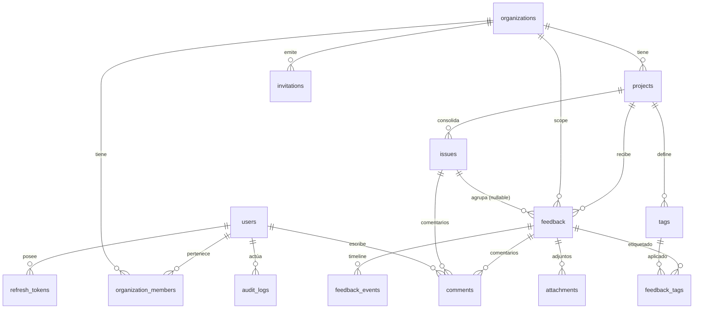

# DATA MODEL — Feedback Platform

Modelo relacional definitivo para el MVP (PostgreSQL 16). Las migraciones Flyway implementan exactamente esto. Cambios aquí ⇒ ADR si es decisión, migración nueva si es esquema.

---

## 1. Convenciones

- PKs `uuid` con `gen_random_uuid()` (PG 13+). IDs nunca secuenciales expuestos (ADR-005).
- Timestamps `timestamptz` NOT NULL DEFAULT `now()`, siempre UTC. `updated_at` se mantiene vía JPA auditing.
- Enums: `varchar` + `CHECK (... IN (...))` (no tipos ENUM de Postgres: más baratos de evolucionar). El enum de aplicación (Java) es la fuente.
- Emails y slugs: `citext` (case-insensitive). Migración V1 crea `CREATE EXTENSION IF NOT EXISTS citext`.
- JSONB solo para payloads flexibles: `metadata`, `technical_context`, `events.data`, `audit_logs.data` (ADR-008).
- `organization_id` desnormalizado en tablas tenant-scoped de alto tráfico (`feedback`, `issues`, `audit_logs`) aunque sea derivable vía `project_id`: aislamiento defensivo + queries simples (ADR-010).
- Sin soft-delete en MVP: borrado real. Si aparece la necesidad, columna `deleted_at` + revisión de índices.
- Nombres `snake_case`; constraints e índices nombrados explícitamente (`fk_`, `uq_`, `ck_`, `idx_`).

## 2. Diagrama ER



## 3. Tablas

### 3.1 `users`

Cuenta de la plataforma (miembro del equipo del SaaS; **no** el usuario final que reporta).

| Columna | Tipo | Constraints | Notas |
|---|---|---|---|
| id | uuid | PK | |
| email | citext | NOT NULL, `uq_users_email` | login |
| name | varchar(120) | NOT NULL | |
| avatar_url | text | NULL | |
| password_hash | varchar(100) | NOT NULL | BCrypt coste 12 |
| email_verified_at | timestamptz | NULL | post-MVP |
| created_at / updated_at | timestamptz | NOT NULL | |

### 3.2 `organizations`

| Columna | Tipo | Constraints | Notas |
|---|---|---|---|
| id | uuid | PK | |
| name | varchar(120) | NOT NULL | |
| slug | citext | NOT NULL, `uq_organizations_slug`, formato `[a-z0-9-]{2,60}` | usado en URLs del dashboard |
| created_at / updated_at | timestamptz | NOT NULL | |

### 3.3 `organization_members`

| Columna | Tipo | Constraints | Notas |
|---|---|---|---|
| id | uuid | PK | |
| organization_id | uuid | NOT NULL, FK → organizations ON DELETE CASCADE | |
| user_id | uuid | NOT NULL, FK → users ON DELETE CASCADE | |
| role | varchar(20) | NOT NULL, `ck_role IN ('OWNER','ADMIN','MEMBER')` | |
| joined_at | timestamptz | NOT NULL DEFAULT now() | |

- `uq_organization_members (organization_id, user_id)`.
- Regla de negocio: toda org conserva ≥1 OWNER (no se puede degradar/expulsar al último).
- Permisos: OWNER = todo + borrar org; ADMIN = gestionar proyectos/miembros/feedback; MEMBER = gestionar feedback (sin gestión de miembros ni ajustes críticos).

### 3.4 `projects`

| Columna | Tipo | Constraints | Notas |
|---|---|---|---|
| id | uuid | PK | |
| organization_id | uuid | NOT NULL, FK ON DELETE CASCADE | |
| name | varchar(120) | NOT NULL | |
| slug | citext | NOT NULL | único por org |
| public_key | varchar(64) | NOT NULL, `uq_projects_public_key` | `fpk_` + 40 chars url-safe; usado por SDK/widget |
| environment | varchar(20) | NOT NULL, `ck IN ('DEVELOPMENT','STAGING','PRODUCTION')` | |
| allowed_origins | jsonb | NOT NULL DEFAULT '[]' | orígenes CORS del widget; `[]` = cualquier origen (documentado) |
| created_at / updated_at | timestamptz | NOT NULL | |

- `uq_projects (organization_id, slug)`.

### 3.5 `invitations`

| Columna | Tipo | Constraints | Notas |
|---|---|---|---|
| id | uuid | PK | |
| organization_id | uuid | NOT NULL, FK ON DELETE CASCADE | |
| email | citext | NOT NULL | |
| role | varchar(20) | NOT NULL, mismo CHECK de roles | |
| token_hash | varchar(64) | NOT NULL, `uq_invitations_token_hash` | SHA-256 del token; el token plano solo viaja en el link |
| invited_by | uuid | NOT NULL, FK → users | |
| status | varchar(20) | NOT NULL DEFAULT 'PENDING', `ck IN ('PENDING','ACCEPTED','REVOKED','EXPIRED')` | |
| expires_at | timestamptz | NOT NULL | 7 días |
| created_at | timestamptz | NOT NULL | |

- `uq_invitations (organization_id, email) WHERE status='PENDING'` (índice parcial): una invitación pendiente por email/org.

### 3.6 `refresh_tokens`

| Columna | Tipo | Constraints | Notas |
|---|---|---|---|
| id | uuid | PK | |
| user_id | uuid | NOT NULL, FK ON DELETE CASCADE | |
| token_hash | varchar(64) | NOT NULL, `uq_refresh_tokens_token_hash` | SHA-256 |
| user_agent | varchar(255) | NULL | informativo |
| ip_hash | varchar(64) | NULL | HMAC de la IP de login |
| expires_at | timestamptz | NOT NULL | 30 días |
| revoked_at | timestamptz | NULL | rotación, logout o detección de reuso |
| replaced_by | uuid | NULL, FK → refresh_tokens | cadena de rotación |
| created_at | timestamptz | NOT NULL | |

### 3.7 `feedback` — entidad principal

| Columna | Tipo | Constraints | Notas |
|---|---|---|---|
| id | uuid | PK | |
| organization_id | uuid | NOT NULL, FK → organizations | desnormalizado (aislamiento) |
| project_id | uuid | NOT NULL, FK → projects | |
| reporter_id | uuid | NULL, FK → users | si lo creó un miembro desde el dashboard (`source=MANUAL`) |
| issue_id | uuid | NULL, FK → issues ON DELETE SET NULL | consolidación |
| type | varchar(20) | NOT NULL, `ck IN ('BUG','IDEA','CONFUSION','GENERAL')` | |
| title | varchar(200) | NOT NULL | |
| description | text | NULL | |
| status | varchar(20) | NOT NULL DEFAULT 'NEW', `ck IN ('NEW','TRIAGED','PLANNED','IN_PROGRESS','DONE','REJECTED')` | |
| priority | varchar(20) | NOT NULL DEFAULT 'MEDIUM', `ck IN ('LOW','MEDIUM','HIGH','CRITICAL')` | |
| source | varchar(20) | NOT NULL, `ck IN ('WIDGET','SDK','API','MANUAL')` | |
| url | text | NULL | página del usuario final |
| route | varchar(500) | NULL | ruta lógica de la SPA |
| browser | varchar(60) | NULL | parseado en el SDK (o del UA) |
| browser_version | varchar(60) | NULL | |
| operating_system | varchar(60) | NULL | |
| viewport_width / viewport_height | int | NULL | |
| app_version | varchar(60) | NULL | versión del frontend del cliente |
| ip_hash | varchar(64) | NULL | HMAC-SHA256(ip); nunca la IP en claro |
| user_agent | varchar(255) | NULL | truncado |
| external_user_id | varchar(120) | NULL | id del usuario final en el SaaS cliente |
| external_user_email | citext | NULL | si el cliente lo proporciona |
| fingerprint | varchar(64) | NULL | dedup futura (Phase 9) |
| metadata | jsonb | NOT NULL DEFAULT '{}' | clave-valor libre del cliente (plano, strings) |
| technical_context | jsonb | NOT NULL DEFAULT '{}' | ver §5 |
| search_vector | tsvector | generada STORED | `to_tsvector('simple', title || ' ' || coalesce(description,''))` |
| created_at / updated_at | timestamptz | NOT NULL | |

**Índices**

```sql
idx_feedback_inbox        ON feedback (project_id, created_at DESC, id DESC);
idx_feedback_status       ON feedback (project_id, status);
idx_feedback_issue        ON feedback (issue_id) WHERE issue_id IS NOT NULL;
idx_feedback_org          ON feedback (organization_id);
idx_feedback_fingerprint  ON feedback (project_id, fingerprint) WHERE fingerprint IS NOT NULL;
idx_feedback_search       ON feedback USING GIN (search_vector);
```

**Notas**
- El screenshot **no** es columna: es un `Attachment(kind='SCREENSHOT')`; la API lo expone como `screenshotUrl` derivado. Evita duplicidad y permite varios adjuntos a futuro (decisión documentada aquí, ref. ADR-009).
- `metadata` se limita a objeto plano string→(string|number|boolean); el backend valida tamaño (≤ 10 KB).
- No hay FK desde `feedback.reporter_id` con ON DELETE restrictivo: si el miembro se borra, `SET NULL`.

### 3.8 `feedback_events`

Timeline de eventos previos al reporte (máx. 50 por feedback, validado en ingesta).

| Columna | Tipo | Constraints |
|---|---|---|
| id | uuid | PK |
| feedback_id | uuid | NOT NULL, FK ON DELETE CASCADE |
| type | varchar(20) | NOT NULL, `ck IN ('PAGE_VIEW','CLICK','NETWORK_ERROR','CONSOLE_ERROR','CUSTOM')` |
| name | varchar(200) | NOT NULL | ej. `POST /api/payment-method 500`, `Clicked "Upgrade"` |
| data | jsonb | NOT NULL DEFAULT '{}' | detalles: `{method, url, status}` / `{selector}` / `{message, stack}` |
| occurred_at | timestamptz | NOT NULL | instante real del evento (lo manda el SDK) |

```sql
idx_feedback_events_timeline ON feedback_events (feedback_id, occurred_at ASC);
```

Ejemplo de timeline renderizable: *Opened billing → Clicked upgrade → POST /payment failed → Feedback submitted*.

### 3.9 `issues`

Problema/solicitud consolidada. N feedbacks → 1 issue.

| Columna | Tipo | Constraints | Notas |
|---|---|---|---|
| id | uuid | PK | |
| organization_id | uuid | NOT NULL, FK | desnormalizado |
| project_id | uuid | NOT NULL, FK ON DELETE CASCADE | |
| title | varchar(200) | NOT NULL | |
| description | text | NULL | |
| status | varchar(20) | NOT NULL DEFAULT 'OPEN', `ck IN ('OPEN','PLANNED','IN_PROGRESS','DONE','REJECTED')` | ciclo propio, distinto del de feedback (decisión deliberada) |
| priority | varchar(20) | NOT NULL DEFAULT 'MEDIUM' | mismo CHECK |
| assignee_id | uuid | NULL, FK → users ON DELETE SET NULL | |
| created_by | uuid | NOT NULL, FK → users | |
| created_at / updated_at | timestamptz | NOT NULL | |

- `feedback_count` se calcula con `COUNT` en query (no columna cache en MVP; añadir contador si el inbox de issues se degrada).
- `idx_issues (project_id, created_at DESC, id DESC)`.

### 3.10 `tags` y `feedback_tags`

`tags`: id (uuid PK), project_id (FK CASCADE), name (varchar(40) NOT NULL), color (varchar(7) NOT NULL, `#RRGGBB`), created_at.
- `uq_tags (project_id, lower(name))` — índice único por expresión.

`feedback_tags`: **PK compuesta** `(feedback_id, tag_id)`, ambas FK ON DELETE CASCADE. Sin columna id propia.

### 3.11 `comments` — tabla única, FK exclusiva (ADR-012)

| Columna | Tipo | Constraints |
|---|---|---|
| id | uuid | PK |
| feedback_id | uuid | NULL, FK ON DELETE CASCADE |
| issue_id | uuid | NULL, FK ON DELETE CASCADE |
| author_id | uuid | NOT NULL, FK → users |
| body | text | NOT NULL |
| created_at / updated_at | timestamptz | NOT NULL |

```sql
ck_comments_exactly_one_target CHECK (num_nonnulls(feedback_id, issue_id) = 1);
idx_comments_feedback ON comments (feedback_id, created_at) WHERE feedback_id IS NOT NULL;
idx_comments_issue    ON comments (issue_id, created_at)    WHERE issue_id IS NOT NULL;
```

Mantiene integridad referencial real (imposible con polimorfismo `entity_type`+`entity_id`) sin duplicar tablas.

### 3.12 `attachments`

| Columna | Tipo | Constraints | Notas |
|---|---|---|---|
| id | uuid | PK | |
| feedback_id | uuid | NOT NULL, FK ON DELETE CASCADE | MVP: solo feedback |
| kind | varchar(20) | NOT NULL, `ck IN ('SCREENSHOT','FILE')` | |
| file_name | varchar(255) | NOT NULL | nombre original (informativo) |
| mime_type | varchar(100) | NOT NULL | validado por magic bytes |
| size_bytes | bigint | NOT NULL | ≤ 5 MB |
| storage_key | text | NOT NULL, UNIQUE | clave opaca en object storage |
| created_at | timestamptz | NOT NULL | |

Los binarios **nunca** en PostgreSQL.

### 3.13 `audit_logs`

| Columna | Tipo | Constraints | Notas |
|---|---|---|---|
| id | uuid | PK | |
| organization_id | uuid | NOT NULL, FK | |
| project_id | uuid | NULL, FK | NULL en acciones a nivel org (invitaciones) |
| actor_id | uuid | NULL, FK → users | NULL = sistema (p. ej. expiración de invitación) |
| action | varchar(60) | NOT NULL | `feedback.status_changed`, `issue.created`, `feedback.linked_to_issue`, `member.invited`… |
| entity_type | varchar(30) | NOT NULL | `FEEDBACK` `ISSUE` `PROJECT` `MEMBER`… |
| entity_id | uuid | NOT NULL | |
| data | jsonb | NOT NULL DEFAULT '{}' | `{"from":"NEW","to":"TRIAGED"}` |
| created_at | timestamptz | NOT NULL | |

```sql
idx_audit_project ON audit_logs (project_id, created_at DESC);
idx_audit_entity  ON audit_logs (entity_type, entity_id, created_at DESC);
```

## 4. Entidades futuras (documentadas, NO en MVP)

| Tabla | Fase | Notas |
|---|---|---|
| `roadmap_items` | 8 | issue_id, estados `UNDER_CONSIDERATION/PLANNED/IN_DEVELOPMENT/RELEASED`, `votes` |
| `roadmap_votes` | 8 | (roadmap_item_id, external_user_id) único |
| `integrations` | 7 | org/project, tipo (SLACK, LINEAR…), config JSONB, secretos cifrados |
| `webhook_deliveries` | 7 | reintentos y trazabilidad |
| `notifications` | post-MVP | in-app para el equipo |
| `project_members` | si hace falta | ver ADR-013 |

## 5. Shapes de payloads JSONB

### `feedback.technical_context` (ingesta)

```json
{
  "sdkVersion": "0.4.1",
  "locale": "es-ES",
  "timezone": "Europe/Madrid",
  "screen": { "width": 1512, "height": 982, "devicePixelRatio": 2 },
  "connection": { "effectiveType": "4g" },
  "custom": {}
}
```

### `feedback_events.data` por tipo

- `PAGE_VIEW`: `{ "url": "...", "route": "/billing", "title": "..." }`
- `CLICK`: `{ "selector": "button#upgrade", "text": "Upgrade" }`
- `NETWORK_ERROR`: `{ "method": "POST", "url": "/api/payment-method", "status": 500, "durationMs": 812 }`
- `CONSOLE_ERROR`: `{ "message": "...", "stack": "...(truncado)" }`
- `CUSTOM`: libre (tamaño limitado).

### `feedback.metadata`

Objeto plano del cliente: `{ "plan": "pro", "accountId": "ac_123", "featureFlagNewCheckout": true }`.

### `audit_logs.data`

Siempre `{ "from": ..., "to": ... }` para cambios, o payload específico (`{"email":"...","role":"ADMIN"}` en `member.invited`).

## 6. Decisión `ProjectMember` (ADR-013)

No existe en MVP: los permisos se derivan del rol de organización. Motivos: menos superficie de autorización, onboarding más simple, y el caso "consultor que solo ve un proyecto" aún no es cliente objetivo. Si aparece: tabla `project_members(project_id, user_id, role)` + chequeo adicional en services; las queries por `organization_id` ya hechas no se rompen (defensa en dos niveles).

## 7. Ciclo de vida y transiciones

**Feedback.status**: `NEW → TRIAGED → PLANNED → IN_PROGRESS → DONE`, y `REJECTED` alcanzable desde cualquier estado. Reapertura permitida (`DONE|REJECTED → TRIAGED`). No se persiste máquina de estados: las transiciones válidas se validan en el service (regla testeable).

**Issue.status**: `OPEN → PLANNED → IN_PROGRESS → DONE` / `REJECTED`; reapertura a `OPEN`.

Toda transición genera `audit_logs` y, cuando existan, eventos para integraciones/notificaciones.

## 8. Estimaciones de volumen (para validar índices)

- 100 orgs × 5 proyectos × 1.000 feedback/mes ⇒ ~6 M feedback/año: índices por `(project_id, created_at)` sobrados.
- `feedback_events`: ≤50/feedback ⇒ hasta 300 M filas/año en el peor caso: aceptable con índice por feedback_id; si crece, particionar o archivar eventos > 90 días (decisión futura).
